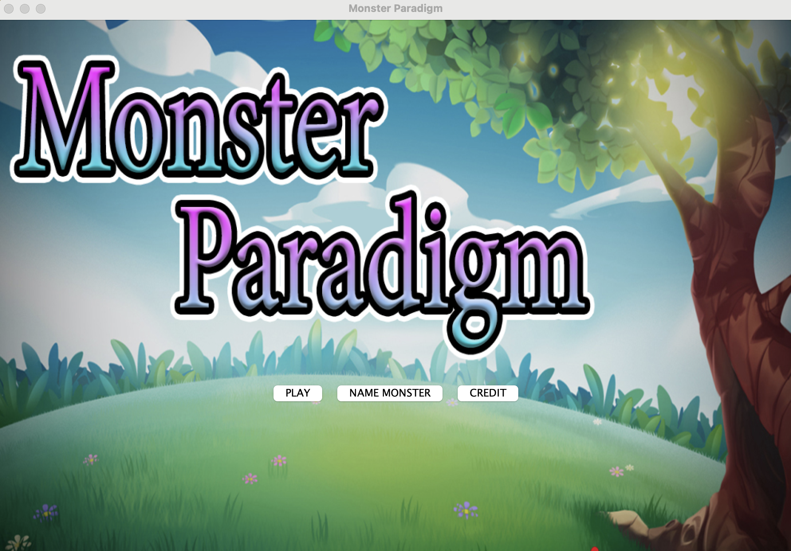
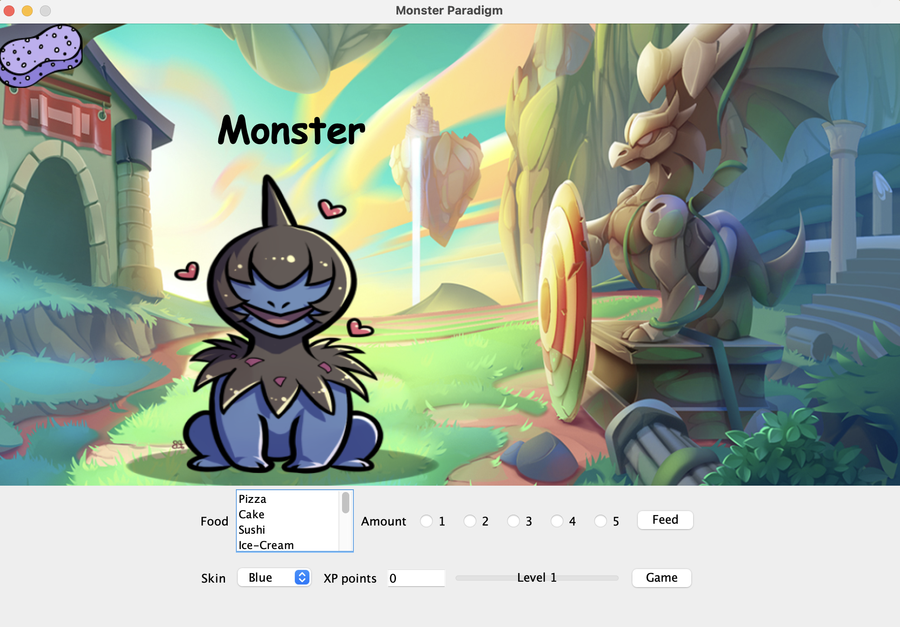
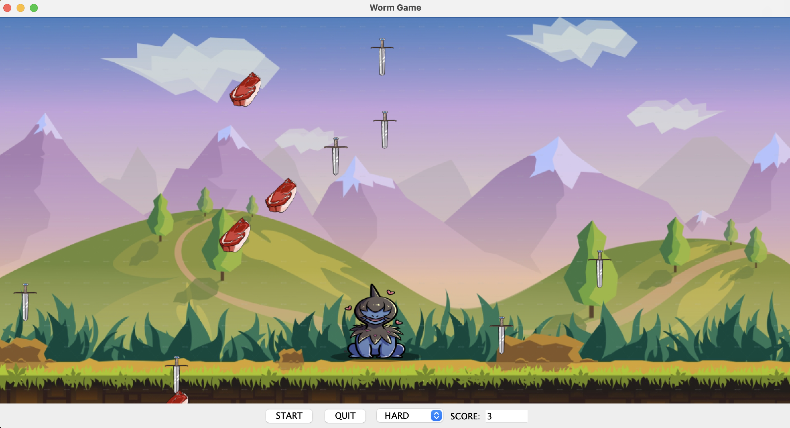

# Monster Paradigm

Java Swing desktop game project with two main screens:

- `Mainapplication`: title screen for naming the monster and starting the game
- `mainroom`: pet-care screen for feeding, petting, skin changes, and XP progression
- `GameRoom`: mini-game where the monster catches good items and avoids bad items

## Screenshots

### Title Screen



### Main Room



### Game Room



## Learning Objectives

This project was developed to practice core Java programming through a small interactive game. The main learning goals were:

- applying object-oriented programming concepts in Java
- building GUI applications with Java Swing
- handling user events and interactive game logic
- working with images, audio, and visual state changes
- designing simple progression systems such as XP and leveling

## Requirements

- Java JDK 15 or newer
- Tested in this workspace with OpenJDK `25.0.2`

The code uses modern Java features such as text blocks and switch arrow labels, so older JDKs will not compile it correctly.

## Project Structure

```text
.
├── Mainapplication.java
├── mainroom.java
├── GameRoom.java
├── util_title.java
├── util_main.java
├── Utilities_gameroom.java
├── resource_title/
├── resource_mainroom/
├── resource_gameroom/
├── .vscode/launch.json
└── Monster_Paradigm/          # compiled `.class` output
```

## Package Name

The Java package name is:

```java
package Monster_Paradigm;
```

Run the app with:

```bash
java Monster_Paradigm.Mainapplication
```

## Compile And Run

Open a terminal in this project folder, then run:

```bash
javac -d . *.java
java Monster_Paradigm.Mainapplication
```

## Run In VS Code

This project includes a VS Code Java launch configuration:

- launch config name: `Run Monster Paradigm`
- main class: `Monster_Paradigm.Mainapplication`

To run it in VS Code:

1. Open this folder as the workspace root.
2. Make sure the Java Extension Pack is installed.
3. Run the `Run Monster Paradigm` launch configuration.

## Gameplay Overview

### Title Screen

- Click `NAME MONSTER`
- Enter a monster name
- Click `Ok!`
- Click `PLAY`

### Main Room

- Pet the monster to gain XP
- Use the sponge item to brush the monster
- Feed the monster by choosing food and amount
- Change monster skin with the skin selector
- Gain enough XP to level up the monster form
- Click `Game` to open the mini-game

### Game Room

- Move with left and right arrow keys
- Catch meat for points
- Avoid swords to prevent losing points
- Use `START` to begin the item drop loop
- Use `QUIT` to return to the main room and convert score into XP

## Notes

- Resource files are loaded from the top-level folders `resource_title/`, `resource_mainroom/`, and `resource_gameroom/`.
- The UI was adjusted for better behavior in VS Code/macOS compared with the earlier NetBeans-oriented layout.
- If old compiled folders such as `Project3_6480728/` still exist, they are stale build output from the previous package name and can be removed.

## Credits

- Pannawish Kriengyakul
- Papon Suramanont
- Premwiss Seenumngernmee
- Rapeepat Pokpattanakul
- Panya Mahasrisaengpetch
